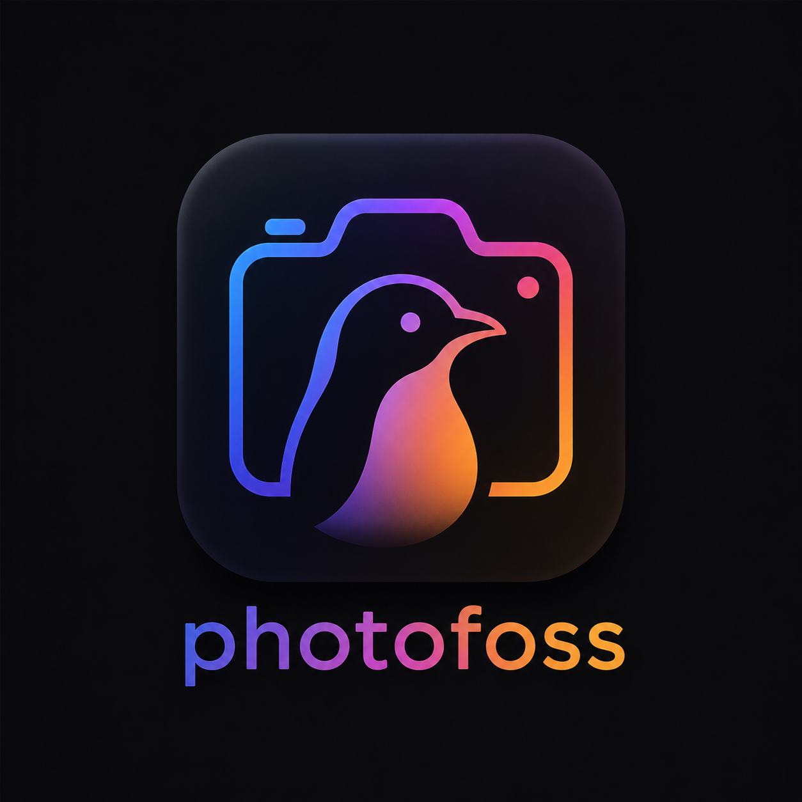

<div align="center">
  
  <h1>PhotoFOSS</h1>
  <p><strong>Professional Photo Editor — Free & Open Source</strong></p>

  [](https://github.com/vsingh66388-oss/PhotoFOSS/stargazers)
  [](https://github.com/vsingh66388-oss/PhotoFOSS/forks)
  [](https://github.com/vsingh66388-oss/PhotoFOSS/blob/main/LICENSE)
  [](https://buymeacoffee.com/ailieisqueen)

</div>

PhotoFOSS is a professional, web-based photo editor with Photoshop-class tools running entirely in your browser. It supports non-destructive editing, custom adjustment layers, pixel-perfect layer masks, advanced selection tools, and robust painting/retouching capabilities.

## ✨ Features

- **Layer Stack & Blending Modes**: Control visibility, opacity, clipping masks, and standard blend modes (Normal, Multiply, Screen, Overlay, Color Dodge, etc.).
- **Adjustment Layers**: Non-destructive adjustment layers for Brightness & Contrast, Hue & Saturation, Color Balance, and Black & White.
- **Layer Masks**: Link/unlink and paint on layer masks to non-destructively hide or reveal parts of layers.
- **Selection Tools**: Rectangle Marquee, Ellipse Marquee, Lasso, Magnetic Lasso, and Magic Wand.
- **Painting & Retouching**:
  - Adjustable Brush Tool
  - Clone Stamp (with sample point Selection)
  - Spot Healing Tool (content-aware local blending)
  - Smudge, Blur, Sharpen, Dodge, and Burn tools
- **Vector Graphics & Typography**: Pen tool for paths, vector shapes (Rectangle, Circle, Line, etc.), and rich text layers.
- **Gradients**: Linear and radial gradients with primary and secondary color blending.
- **Flexible Canvas & Templates**: Pan, zoom, and select from preset social/print/screen templates.

## 🚀 Run Locally

### Prerequisites

Ensure you have [Node.js](https://nodejs.org/) (v18+) installed.

### Installation

```bash
# Clone the repository
git clone https://github.com/vsingh66388-oss/PhotoFOSS.git
cd PhotoFOSS

# Install dependencies
npm install

# Start the development server
npm run dev
```

Open your browser and navigate to **http://localhost:3000**.

## 📦 Production Build

```bash
# Build the frontend and bundle the server
npm run build

# Start the production server
npm start
```

## ☕ Support

If you find PhotoFOSS useful, consider supporting the project:

[](https://buymeacoffee.com/ailieisqueen)

## 📄 License

This project is licensed under the **Apache-2.0 License**.
